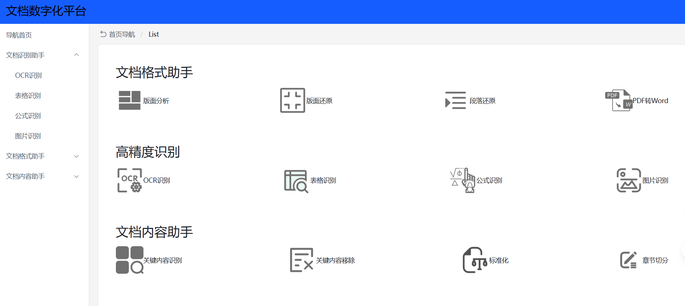
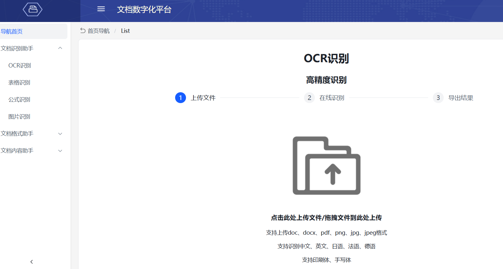
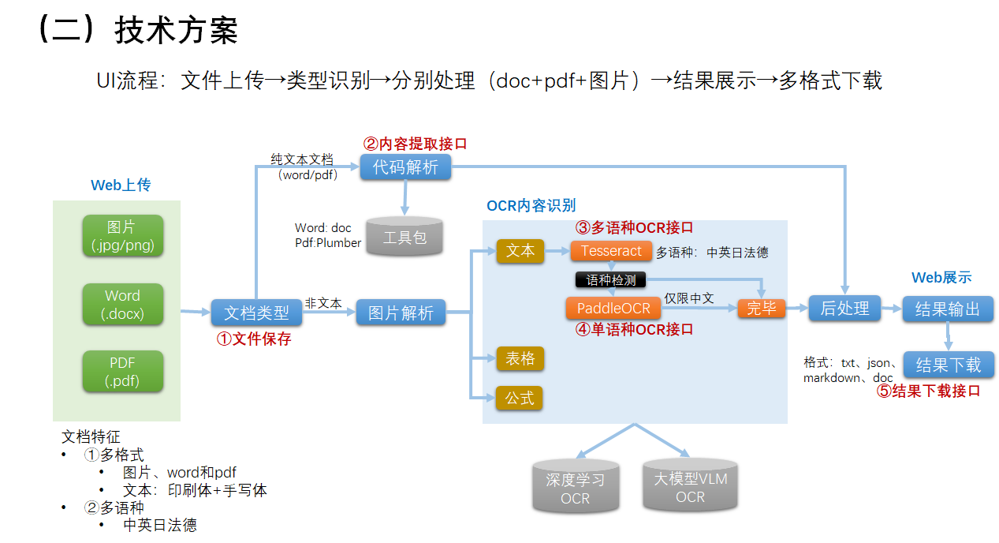
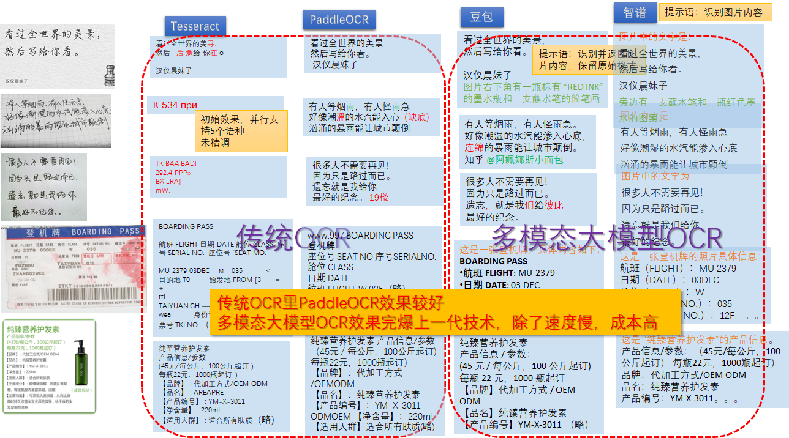
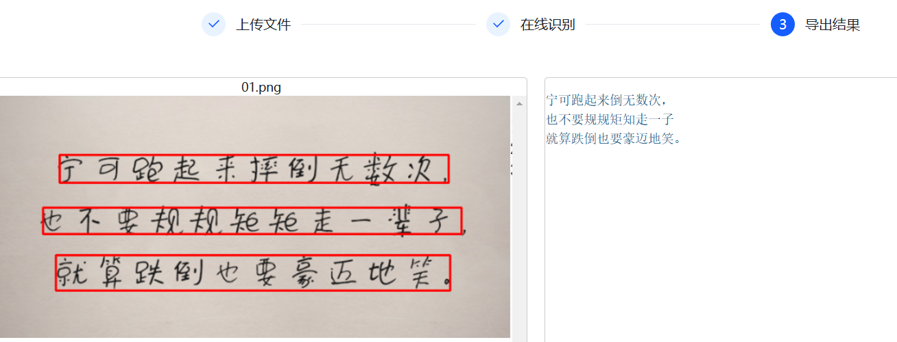

# ocr_project_two

OCR 项目, 实现多文件类型、多语种的离线OCR检测功能

## UI

Web UI
- 
- 

## 整体结构

整个项目分为
- (1) 前端代码: `ocr-ui` 目录
- (2) 后端代码: `backend` 目录
- 数据目录:
  - `cache_file` 用户上传文件缓存目录

技术流程图
- 

不同OCR方案对比
- 


## 功能

主要功能
- 多语种: 中英日法德, 语种可定制
- 文字识别: 印刷体、手写体
- 文档解析: word/pdf
- 结果可视化

部分难样本实测
- 
- 

## 部署

步骤
- 后端
  - 后端服务框架: flask
  - OCR工具: tesseract/PaddleOCR
    - tesseract 安装: 
      - 先去[官网](https://github.com/UB-Mannheim/tesseract/wiki)找对应操作系统的软件并安装
        - windows [软件包](https://digi.bib.uni-mannheim.de/tesseract/tesseract-ocr-w64-setup-v5.3.0.20221214.exe)
      - 其次才是安装 python 接口 `pip install pytesseract`
    - PaddleOCR 安装: 需要安装 百度深度学习框架 飞浆，其次才是 paddleocr
      - `pip install paddlepaddle paddleocr`
  - 文档解析工具: word, pdf 解析工具
- 前端
  - 依赖: node.js


### 在线部署

现在有网环境，联网部署，再去无网环境使用

环境准备
- (1) 后端环境
  - ① Python 安装: 取[网址](https://www.python.org/ftp/python/3.11.1/) 下载对应系统的Python安装包
    - 如 win 10 系统, 下载 exe 文件, [地址](https://www.python.org/ftp/python/3.11.1/python-3.11.1.exe)
    - 双击安装，注意：
      - 勾选 添加环境变量, 否则，需要添加 Python bin 路径到 环境变量 Path 中
      - 勾选 安装 pip, 否则, 需要手工安装 pip
  - ② pip 安装：
    - 如果已安装，略过
    - 手工安装
      - 快捷命令: `python -m ensurepip --default-pip`
      - 或 访问 [https://bootstrap.pypa.io/get-pip.py](https://bootstrap.pypa.io/get-pip.py)，下载 get-pip.py 文件, 当前目录执行 `python get-pip.py`
- (2) 前端环境
  - 安装 node.js:
    - 去[官网](https://nodejs.org/en/download/)选择对应版本, 如 win10 64位安装包 [地址](https://nodejs.org/dist/v22.12.0/node-v22.12.0-x64.msi)
    - 双击安装


```sh
# （1）环境准备

# 获取源码
git clone https://github.com/wqw547243068/ocr_project_two.git

cd ocr_project_two
# 安装python依赖包
# pip install -r requirements.txt
pip install Flask # demo
# 启动后端服务
cd backend
python flask_web_demo.py # demo
# python flask_web.py # online

# 启动前端服务
cd ocr-ui
npm install # 生成 dist 目录
npm run dev # 确认页面功能正常

```


### 离线部署


```sh
# 后端源码,更新已有文件
git clone https://github.com/wqw547243068/ocr_project_two.git

# (1) 后端
# 准备绿色版python 3.11.1
wget https://www.python.org/ftp/python/3.11.1/python-3.11.1-embed-amd64.zip
# 解压后, 添加路径到 系统变量 path 路径
# 准备 get-pip.py
访问 https://bootstrap.pypa.io/get-pip.py, 右键另存为 get-pip.py

# 准备离线wheel包
pip download -d ./packs -r requirements.txt

# (2) 前端 

# node.js 下载，确认可用
wget https://nodejs.org/dist/v22.12.0/node-v22.12.0-win-x64.zip
# 准备前端编译版
cd ocr-ui
npm install # 生成 dist 目录
npm run dev # 确认页面功能正常

# ------------【文件复制】-----------------
复制 Python、get-pip.py、 packs 包、源码库 （含dist目录）、node.js 到目标机器（无网）

# ------------【无网环境】------------

# 文件复制
$a='U盘复制过来的目录'
cd $a
# 安装 node.js, 双击

# 添加Python路径到 系统变量 path 路径

# 安装 pip
python get-pip.py
# 安装工具包
cd $a
pip install --no-index --find-links=./packs -r requirements.txt

cd ocr_project_two

# 启动后端服务
cd backend
python flask_web.py

# 启动前端服务
cd ocr-ui
npm install # 生成 dist 目录
npm run dev # 确认页面功能正常

# 打开网页 127.0.0.1:5000

```

### 问题

【2024-12-16】

操作系统及软件版本旧导致，如： 
- ① 缺乏vc库，导致paddlepaddle安装失败, `import paddle` 无法执行，找不到libpaddle 
  - 错误: `Error: Can not import avx core while this file exists`
  - 解法: 安装[vc_redist.x64](https://blog.csdn.net/fuck_hang/article/details/114578986) 
- ② 浏览器（IE+Chrome）旧了，导致不支持pdf预览插件，网页白屏
  - 80.* 版本的chrome无法加载pdf浏览插件 pdf.js, 报语法错误, 导致前端页面白屏
  - 解法: 升级浏览器

## 前端


技术栈
- `Vite` + `React` + `TypeScript`

修改文件
- `vite.config.ts` 里 target处写后端接口 http：//ip +port
- `util/uploadfile.tsx` 68和71行改为 /api/oc

运行
- 先确保后端服务已启动

```sh
# 根目录, 删除 \node_modules 目录（如果存在）
npm install # 安装 node.js 工具包
npm run dev # 启动 Web UI 服务
```

详见[文档](ocr-ui/README.md)

## 后端

flask 构建的Python服务
- word 文档: 直接解析
- pdf 文档: 直接解析
- 图片文件: OCR 分别处理

启动后端服务

```sh
cd backend
python flask_web.py &>log.txt &
```


## 其它

